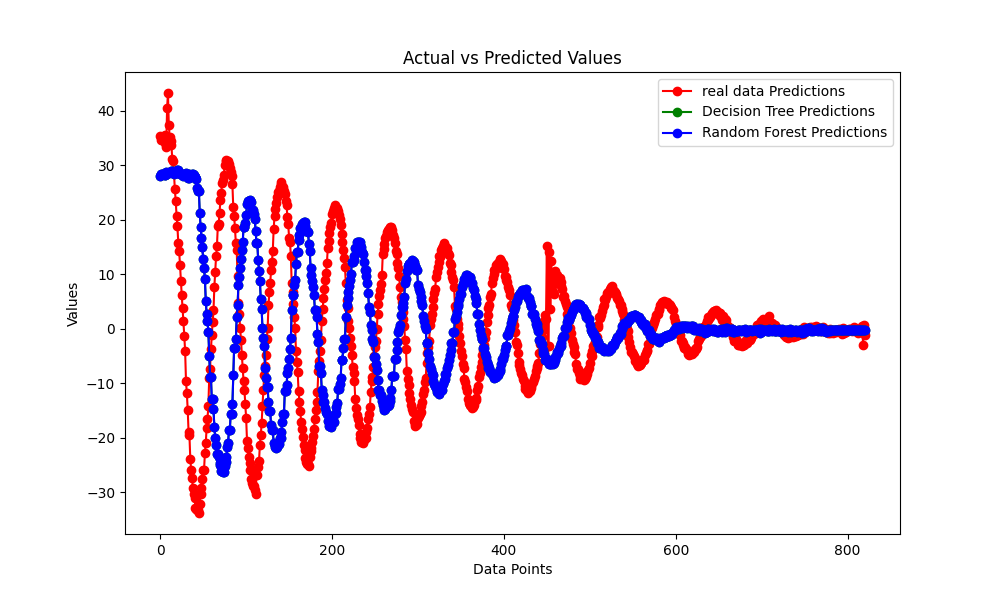
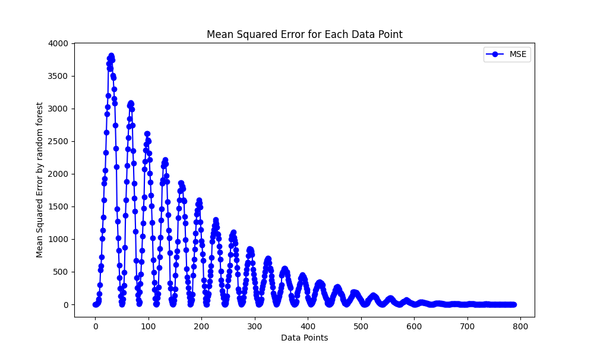
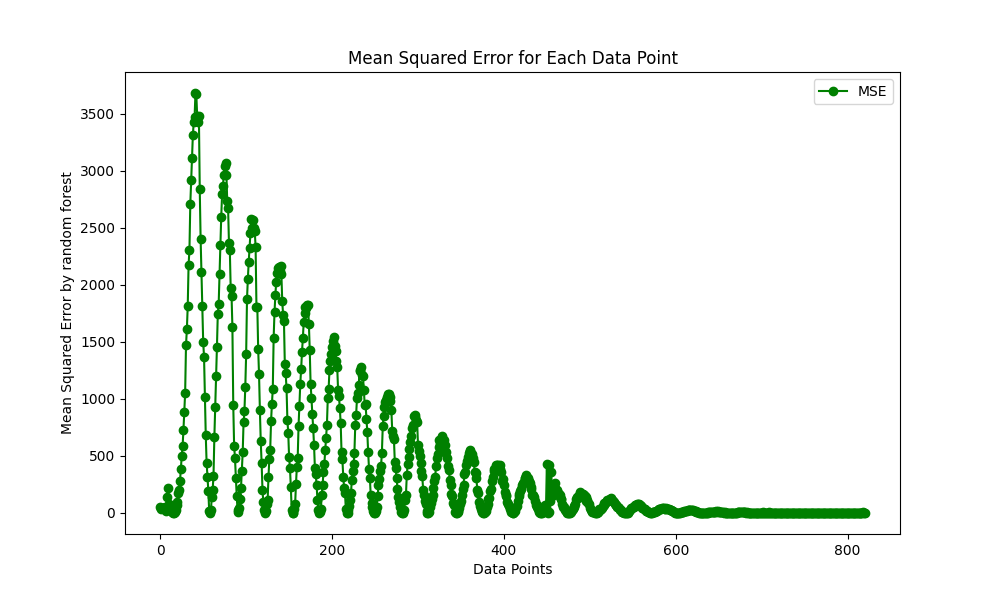

# Electromagnetmotion-explorer

**Electromagnet Motion Explorer** is an innovative project aimed at studying pendulum damping motion through LED modeling and the development of a user-friendly desktop application. This project serves as a comprehensive study tool, providing intricate mathematical models, accurate simulations, and the integration of machine learning models for error detection and regression analysis. Explore the fascinating world of electromagnetism and motion damping with this interactive and educational platform.

## Features

- **LED Modeling:** Visualize pendulum damping motion through LED modeling, gaining a deeper understanding of electromagnetic interactions.
- **Accurate Simulations:** Utilize precise mathematical models to conduct simulations, ensuring accuracy and reliability in the study of motion dynamics.
- **User-Friendly Desktop Application:** Experience a seamless interface and smooth interactions with the desktop application developed using ElectronJs and NextJs.
- **Real-time Data Exploration:** Engage with real-time data exploration features, allowing users to observe and analyze the effects of different parameters on pendulum damping motion instantaneously.
- **Arduino Integration:** Collaborative efforts with the team led to the integration of Arduino connections, enhancing the project's functionality and providing a hands-on experience for users.
- **Machine Learning Integration:** Integrated machine learning models for error detection and regression analysis, providing advanced tools for data analysis and enhancing the project's functionality.

## Installation

To run the Electromagnet Motion Explorer desktop application locally, follow these steps:

1. **Clone the Repository:**

   ```
   git clone https://github.com/shivam6862/Electromagnetmotion-explorer.git
   cd electromagnet-motion-explorer
   ```

2. **Install Dependencies:**

   ```
   npm install
   ```

3. **Start the Application:**
   ```
   npm run dev
   ```
4. **machine-learning-models**
   ```
       cd machine-learning-models
       pip install `requirements.txt`
       python main.py
   ```
5. **mobile-application**

```
install all the dependencies
```

## Usage

1. Launch the application after installation.
2. Explore the LED modeling and simulation features to visualize pendulum damping motion.
3. Use the real-time data exploration tools to interact with the simulations and observe the effects of different parameters on electromagnet motion.
4. Enjoy a seamless and intuitive interface designed for an optimal user experience.

## Snapshot

### Home Page


### Working model Page


### Machine learning actual vs predicted graph



### mean squared error by Decision Tree



### mean squared error by RandomForest



## Contributing

We welcome contributions and feedback from the community. If you have suggestions, feature requests, or find any issues, please feel free to open an issue or submit a pull request. Your contributions help us improve and enhance the project for everyone.

## Acknowledgments

We would like to express our gratitude to the team members and collaborators who contributed to the development of Electromagnet Motion Explorer. Your dedication and expertise have been instrumental in creating this valuable educational tool.

Thank you for exploring Electromagnet Motion Explorer! We hope you find it insightful and educational. Happy studying! 🚀
